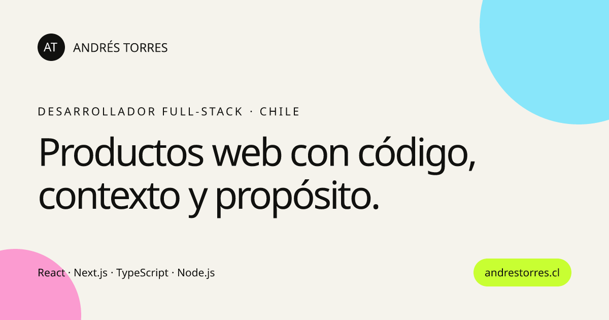

# Portafolio de Andrés Torres

Portafolio profesional multilingüe de Andrés Torres, desarrollador full-stack de Concepción, Chile. Presenta proyectos, casos de estudio, experiencia técnica y un formulario de contacto protegido contra spam.

[Visitar andrestorres.cl](https://www.andrestorres.cl/) · [LinkedIn](https://www.linkedin.com/in/andr%C3%A9s-felipe-torres-castro-016587327/) · [GitHub](https://github.com/sdraen)



## Características

- Diseño responsive para escritorio y dispositivos móviles.
- Contenido disponible en español, inglés, portugués y francés.
- Modo claro y oscuro con preferencia persistente.
- Animaciones accesibles que respetan `prefers-reduced-motion`.
- Casos de estudio con rutas y metadatos independientes.
- CV descargable en español e inglés.
- Formulario protegido con Cloudflare Turnstile.
- SEO técnico con metadatos, Open Graph, datos estructurados, `hreflang`, `robots.txt` y sitemap.
- Exportación estática preparada para GitHub Pages y dominio personalizado.

## Tecnologías principales

- Next.js 14 con App Router
- React 18 y TypeScript
- Framer Motion
- Next Themes
- Lucide React
- Cloudflare Turnstile y Cloudflare Workers
- Google Analytics opcional
- GitHub Pages

## Arquitectura

La interfaz utiliza una sola estructura visual para todos los idiomas. Cada ruta selecciona un código de idioma y se lo entrega al componente `Portfolio`:

```tsx
export default function EnglishPortfolioPage() {
  return <Portfolio locale="en" />
}
```

El componente obtiene el diccionario correspondiente y renderiza los mismos bloques con el contenido traducido:

```tsx
const content = homeCopy[locale]

<h1>{content.hero.line1}</h1>
<a href="#proyectos">{content.nav.projects}</a>
```

```text
URL → página de Next.js → idioma → diccionario → componentes → HTML estático
```

La mayor parte del sitio se genera como HTML estático. La navegación, las animaciones, el selector de tema y el formulario se activan en el navegador como componentes interactivos.

## Internacionalización

Las traducciones están escritas manualmente; el sitio no depende de un traductor automático ni de una API externa. Esto permite mantener un tono profesional, controlar el SEO y generar una página estática por idioma.

| Idioma | Ruta principal | Código HTML |
|---|---|---|
| Español de Chile | `/` | `es-CL` |
| Inglés | `/en/` | `en` |
| Portugués de Brasil | `/pt/` | `pt-BR` |
| Francés de Canadá | `/fr/` | `fr-CA` |

Los textos generales se encuentran en `lib/i18n.ts`. Los textos y metadatos de los casos de estudio están en `lib/case-studies.ts`.

El selector de idioma:

- genera enlaces reales para cada versión;
- utiliza `lang` y `hrefLang`;
- conserva la ruta del caso de estudio cuando corresponde;
- actualiza el atributo `lang` del documento;
- muestra banderas SVG sin descargar imágenes externas.

## Estructura del proyecto

```text
app/
├── page.tsx                         # Página principal en español
├── en/, pt/, fr/                    # Rutas de los demás idiomas
├── proyectos/                       # Casos de estudio en español
├── layout.tsx                       # Fuentes, metadatos y proveedores
├── globals.css                      # Diseño, temas y responsive
├── robots.ts
└── sitemap.ts

components/
├── portfolio.tsx                    # Interfaz principal
├── project-case-study.tsx           # Vista reutilizable de proyectos
├── language-switcher.tsx            # Selector de idioma
├── theme-provider.tsx               # Estado del tema
├── theme-toggle.tsx                 # Botón claro/oscuro
├── contact-form.tsx                 # Formulario de contacto
└── turnstile-widget.tsx             # Integración anti-spam

lib/
├── i18n.ts                           # Textos, rutas y SEO multilingüe
└── case-studies.ts                   # Contenido de los casos de estudio

worker/
├── src/index.ts                      # Endpoint seguro del formulario
└── wrangler.jsonc                    # Configuración de Cloudflare Worker

public/                               # Imágenes, iconos y CV
docs/                                 # Exportación publicada por GitHub Pages
```

## Ejecución local

Requisitos:

- Node.js 20 o una versión compatible.
- npm.

```bash
git clone https://github.com/Sdraen/portafolio.git
cd portafolio
npm install
cp .env.example .env.local
npm run dev
```

Luego abre [http://localhost:3000](http://localhost:3000).

En PowerShell puedes copiar las variables con:

```powershell
Copy-Item .env.example .env.local
```

## Variables de entorno

```env
NEXT_PUBLIC_GOOGLE_ANALYTICS_ID=
NEXT_PUBLIC_TURNSTILE_SITE_KEY=
NEXT_PUBLIC_CONTACT_ENDPOINT=
```

`NEXT_PUBLIC_TURNSTILE_SITE_KEY` y `NEXT_PUBLIC_CONTACT_ENDPOINT` son valores públicos utilizados por el navegador.

Los siguientes valores son secretos y deben configurarse únicamente en Cloudflare Worker:

```text
TURNSTILE_SECRET_KEY
WEB3FORMS_ACCESS_KEY
```

Nunca deben llevar el prefijo `NEXT_PUBLIC_`, guardarse en Git ni incluirse en el sitio estático.

## Formulario de contacto

El navegador envía el formulario al endpoint indicado por `NEXT_PUBLIC_CONTACT_ENDPOINT`. El Worker:

1. valida el origen de la solicitud;
2. verifica el token de Cloudflare Turnstile;
3. rechaza solicitudes inválidas o automatizadas;
4. reenvía el mensaje mediante Web3Forms;
5. mantiene las claves privadas fuera del frontend.

Para ejecutar el Worker localmente:

```bash
npm run worker:dev
```

Para desplegarlo, después de configurar sus secretos:

```bash
npm run worker:deploy
```

## Scripts

| Comando | Descripción |
|---|---|
| `npm run dev` | Inicia Next.js en modo desarrollo. |
| `npm run build` | Compila y valida la aplicación. |
| `npm run build:pages` | Genera la exportación estática dentro de `docs/`. |
| `npm run worker:dev` | Ejecuta localmente el Worker del formulario. |
| `npm run worker:deploy` | Publica el Worker en Cloudflare. |

## Publicación

El proyecto utiliza `output: "export"` en `next.config.js`. El comando `npm run build:pages` genera el sitio estático, lo mueve a `docs/` y conserva los archivos necesarios para el dominio personalizado.

```text
Código fuente → Next.js export → docs/ → GitHub Pages → Cloudflare → andrestorres.cl
```

GitHub Pages publica la carpeta `docs/` desde la rama `main`. Cloudflare administra DNS, HTTPS, CDN y protección del tráfico.

## Autor

**Andrés Torres**  
Desarrollador full-stack · Concepción, Chile

- Sitio: [andrestorres.cl](https://www.andrestorres.cl/)
- GitHub: [github.com/sdraen](https://github.com/sdraen)
- LinkedIn: [Andrés Felipe Torres Castro](https://www.linkedin.com/in/andr%C3%A9s-felipe-torres-castro-016587327/)
- Correo: [andrestorresdev@gmail.com](mailto:andrestorresdev@gmail.com)
